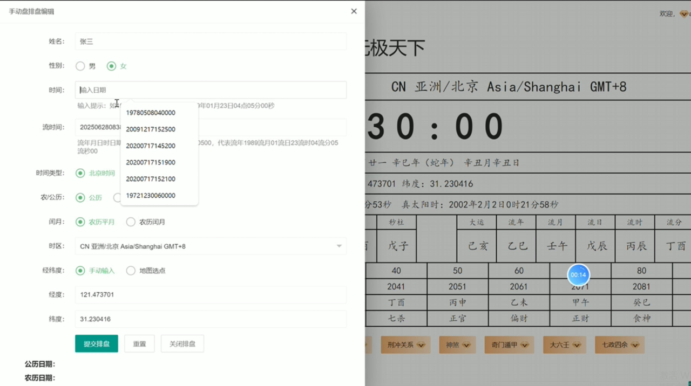
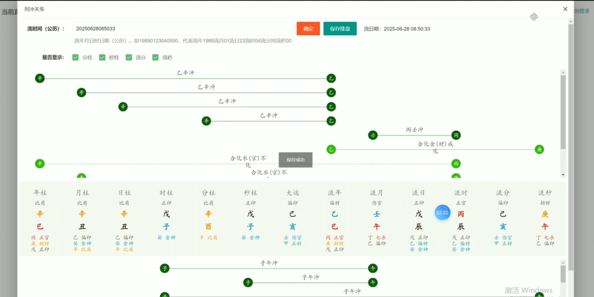
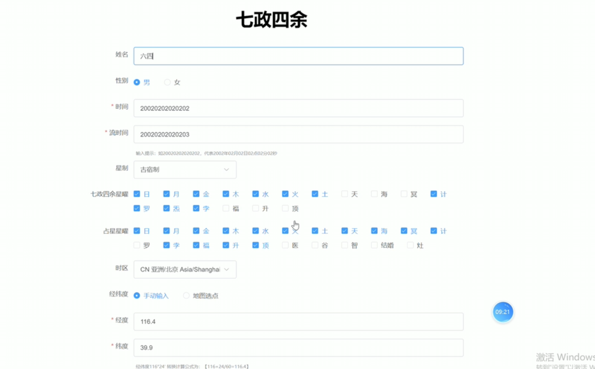
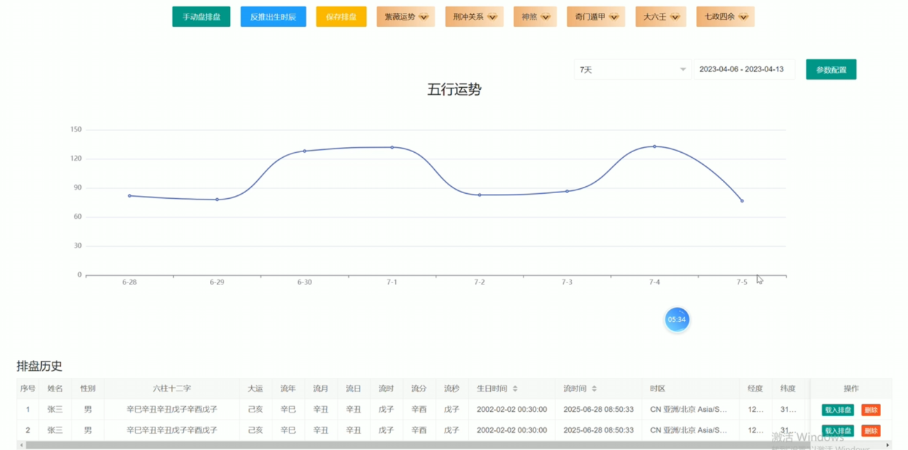

# CosmicChart 周易易经八卦排盘｜四柱八字中国传统术数排盘引擎

[简体中文](README.md) | [繁體中文](README.zh-TW.md) | [English](README.en.md) | [项目主页](https://alibabamayun888.github.io/CosmicChart-Metaphysics-Engine/)

<p align="center">
  
  
  
</p>

**CosmicChart Metaphysics Engine（天元命盘引擎）**是一个面向中国传统术数数字化研究的 Web 排盘项目。线上仓库当前包含 HTML、JavaScript、Layui 资源以及命理排盘相关页面，展示手动排盘、八字刑冲关系、七政四余参数配置、五行运势曲线与排盘历史等功能界面。

项目围绕四柱八字、奇门遁甲、七政四余、紫微斗数、大六壬和神煞等术数主题组织文档。README 只陈述当前仓库或产品截图能够确认的内容；若后续发布 Java/Spring Boot、Vue、MySQL 或 API 服务，应同时提交对应源码和可执行文档。

## 目录

- [项目概述](#项目概述)
- [术数模块](#术数模块)
- [当前技术结构](#当前技术结构)
- [核心界面](#核心界面)
- [时间与地理参数](#时间与地理参数)
- [产品截图](#产品截图)
- [仓库结构](#仓库结构)
- [使用方式](#使用方式)
- [数据与隐私](#数据与隐私)
- [常见问题](#常见问题)
- [文化与投资免责声明](#文化与投资免责声明)
- [许可证](#许可证)
- [联系与支持](#联系与支持)

## 项目概述

CosmicChart 旨在把传统命理排盘的输入、计算结果和可视化界面转化为便于研究与扩展的 Web 工程。当前截图展示了出生时间、流年时间、时区、经纬度、农历设置、星曜选择、刑冲关系和五行趋势等交互。

| 能力 | 当前可见内容 |
| --- | --- |
| 排盘参数 | 姓名、性别、出生时间、流年时间、历法、时区、经纬度 |
| 八字关系 | 年柱、月柱、日柱、时柱、大运和流年等柱位关系 |
| 刑冲分析 | 刑、冲、合、害等关系的图形化展示 |
| 七政四余 | 七政及四余星曜选择、地区与时间参数设置 |
| 五行运势 | 指定时间范围的趋势曲线 |
| 历史记录 | 保存、载入和管理排盘记录的界面 |

## 术数模块

线上 README 将项目定位为综合术数计算平台，涵盖以下方向：

### 四柱八字

围绕年柱、月柱、日柱、时柱、十神、藏干、大运、流年及刑冲合害关系组织排盘和分析界面。

### 奇门遁甲

仓库根目录包含 [`qimen.html`](qimen.html)，可作为奇门遁甲相关页面入口。具体排局方法与算法覆盖应以该页面及其引用脚本为准。

### 七政四余

产品截图展示七政四余参数页，可选择七政、四余及其他星曜，并设置时间、时区和经纬度等排盘参数。

### 紫微斗数、大六壬与神煞

这些模块出现在项目现有定位与页面导航中。若要对外声明完整算法能力，建议补充对应源码入口、示例输入输出、测试用例和算法参考文献。

### 数字资产周期研究

线上 README 提到将传统星历方法用于数字资产周期观察。此类内容仅适合文化或学术研究，不能用于承诺价格走势、收益或交易时点。

## 当前技术结构

根据线上仓库根目录可以确认：

- 静态 HTML 页面：`qimen.html`、`mail-login.html`
- JavaScript 资源：`js/`
- Layui 前端组件：`layui/`
- 项目资料：`doc/`
- GitHub Pages 与产品截图：`docs/`

线上 README 原先描述了 Vue3、Spring Boot、Java 17、MySQL、Redis 和 REST API，但当前根目录未显示对应的 `frontend/`、`backend/`、`sql/` 或服务端构建文件。因此优化版不提供这些模块的虚构安装命令。

## 核心界面

### 手动排盘

支持填写人物信息、时间、历法、时区与经纬度，并提交排盘参数。

### 刑冲关系图

以图形连线展示不同柱位之间的刑、冲、合、害等关系，并结合干支、十神和大运流年信息阅读。

### 七政四余参数

配置七政四余星曜、时间、流年、时区与地理坐标，为星盘计算提供输入。

### 五行运势与历史

通过趋势图展示指定周期内的五行变化，并在历史列表中保存或载入已有排盘。

## 时间与地理参数

传统术数计算常涉及公历与农历、节气交接、时区、经纬度和真太阳时。实现时应：

1. 明确时间输入格式和时区。
2. 保存原始时间与转换后的时间，避免重复转换。
3. 标注历法、节气和星历数据来源及版本。
4. 为边界日期、闰月、夏令时和跨时区输入编写测试。
5. 对经纬度和出生资料实施最小化存储与访问控制。

## 产品截图

### 手动排盘编辑



### 八字刑冲关系图



### 七政四余参数配置



### 五行运势与排盘历史



## 仓库结构

```text
CosmicChart-Metaphysics-Engine/
├── doc/                         # 项目资料
├── docs/
│   ├── index.html               # 简体中文 GitHub Pages
│   ├── en/index.html            # 英文页面
│   ├── zh-TW/index.html         # 繁体中文页面
│   └── assets/Screenshots/      # 产品截图
├── js/                          # JavaScript 资源
├── layui/                       # Layui 前端资源
├── mail-login.html              # 登录相关页面
├── qimen.html                   # 奇门遁甲相关页面
├── wujibazi.jsop                # 当前仓库文件
└── README.md
```

## 使用方式

当前仓库形态以静态 Web 文件为主。由于具体脚本可能依赖相对路径或浏览器策略，建议通过本地 HTTP 服务预览，而不是直接双击 HTML 文件。

发布前应补充：

- 支持的浏览器和运行环境。
- 实际入口页面与演示数据。
- 各模块依赖的 JavaScript 文件。
- 算法测试、已知限制和数据来源。
- 若存在服务端，提交真实构建文件、配置模板和数据库迁移。

## 数据与隐私

姓名、出生日期、出生时间、地理位置和排盘历史可能构成个人信息或敏感画像数据。实际部署应提供清晰的隐私政策，并遵循：

- 仅收集排盘功能必需的数据。
- 明确说明用途、保存期限与删除方式。
- 对传输和存储数据进行保护。
- 不在日志、截图或公开 Issue 中暴露真实个人资料。
- 未经明确同意，不将命盘数据用于营销、画像或模型训练。

## 常见问题

### CosmicChart 是什么？

它是一个中国传统术数 Web 排盘与可视化项目，当前仓库可见 HTML、JavaScript、Layui 页面资源以及八字、七政四余和趋势分析相关产品截图。

### 是否包含完整 Java 后端和 Vue 前端？

当前线上根目录没有显示 `backend/` 或 `frontend/`。若这些代码位于其他分支或尚未上传，应在发布后再补充相应说明和运行命令。


### 如何提升项目的可信度？

公开算法来源、时间与历法数据版本、边界测试、示例输入输出和已知误差，比重复堆砌关键词更有助于开发者理解和搜索引擎收录。

## 文化与投资免责声明

本项目用于传统文化数字化、软件开发和学术交流。排盘、运势、星历或数字资产周期内容仅供文化探索与娱乐参考，不构成医疗、法律、财务或投资建议，也不保证准确性或结果。

## 许可证

当前线上仓库根目录未显示标准 `LICENSE` 文件，因此本 README 不继续声明 MIT。代码所有者应在发布前选择真实适用的许可证并提交完整条款；在此之前，默认版权仍由权利人保留。

## 联系与支持

| 渠道 | 地址 |
| --- | --- |
| Email | <ttpoker40@gmail.com> |
| Telegram | [@alibabama401](https://t.me/alibabama401) |
| Issues | [CosmicChart GitHub Issues](https://github.com/alibabamayun888/CosmicChart-Metaphysics-Engine/issues) |
